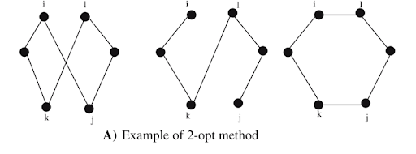

# Introduction

The Traveling Salesman Problem (TSP) is one of the most famous problems in combinatorial optimization and theoretical computer science. Informally, a traveling salesperson wants to visit a set of cities, each exactly once, and return to the starting point, while minimizing the total distance of the tour.

The exact origin of the TSP is unclear. An early appearance is in an 1832 handbook for traveling salesmen that presented example tours through Germany and Switzerland. In the 19th century, William Rowan Hamilton and Thomas Kirkman gave early mathematical formulations of problems that are essentially TSP-like. In the 20th century, interest in TSP exploded as it became a central benchmark for algorithms and computational complexity.

Despite its simple statement, TSP is extremely challenging. In general graphs, the problem is NP-Hard, and exact methods become infeasible very quickly as the number of cities grows. This has motivated the development of approximation algorithms and heuristics that produce good, but not necessarily optimal, tours in polynomial time.

This report is based on a class presentation and aims to:

* present the TSP and its complexity,
* describe several approximation and heuristic algorithms (Nearest Neighbor, Christofides, and 2-Opt),
* discuss their performance on benchmark instances, including a large Canada 4663-city dataset.

# The Traveling Salesman Problem

## Problem definition

Given a set of cities and pairwise distances between them, the Traveling Salesman Problem asks:

> Find the shortest possible tour that visits each city exactly once and returns to the starting city.

More formally, let \(G = (V, E)\) be a complete weighted graph, where (V) is the set of vertices (cities) and (E) is the set of edges with a distance (or cost) function \(c : V \times V \to \mathbb{R}_{\ge 0}\). A **tour** is a permutation of the vertices that forms a cycle, visiting each vertex exactly once and returning to the start. The cost of a tour is the sum of the edge weights along the cycle. The goal is to find a tour of minimum total cost.

TSP appears in many domains beyond literal travel:

* routing delivery trucks and mail,
* planning the path of a drill in printed circuit board manufacturing,
* sequencing tasks in production,
* certain formulations of genome sequencing and data clustering.

## Decision problem formulation

For complexity theory, it is useful to formulate TSP as a decision problem:

\[
\text{TSP} =
\left\{
\begin{aligned}
\langle G, c, k \rangle :\;&
G = (V,E) \text{ is a complete graph},\\
& c : V \times V \to \mathbb{N},\\
& k \in \mathbb{N},\\
& \text{and } G \text{ has a traveling-salesman tour of cost at most } k
\end{aligned}
\right\}.
\]

In words:

> Given a complete weighted graph \(G\) and a bound \(k\), does there exist a tour that visits every vertex exactly once, returns to the start, and has total cost at most \(k\)?

This decision version is convenient to place TSP in complexity classes such as NP and NP-Hard.

## Complexity and NP-Hardness

### Complexity classes

We briefly recall some standard complexity notions:

* A problem (p) is in **NP** if, given a candidate solution, there exists a polynomial-time algorithm to verify that the solution is correct.

* A problem (p) is **NP-Complete** if:

  1. \(p \in \text{NP}\), and
  2. every problem in NP can be reduced to (p) in polynomial time.

* A problem (p) is **NP-Hard** if every problem in NP can be reduced to (p) in polynomial time. It does not need to be in NP itself.

The Traveling Salesman Problem in its optimization form is a classic NP-Hard problem. The decision version of TSP is NP-Complete.

### Proof of NP-Hardness via HAM-CYCLE

A standard reduction to show TSP is NP-Hard uses the Hamiltonian cycle problem:

> **HAM-CYCLE**: Given an undirected graph (G), does (G) contain a Hamiltonian cycle?

A **Hamiltonian cycle** is a simple cycle that starts and ends at some vertex (x) and visits every vertex exactly once. HAM-CYCLE is known to be NP-Complete.

To reduce HAM-CYCLE to TSP, we proceed as follows:

1. Given an instance of HAM-CYCLE with graph (G = (V, E)), construct a complete weighted graph \(G' = (V, E')\), where
\[
E' = \{(i,j)\in V\times V \mid i \neq j\}.
\]
 on the same vertex set.
2. For each pair of vertices (i, j):

   * If \((i, j) \in E\) (original edge exists), set \(c(i, j) = 0\).
   * If \((i, j) \notin E\), set \(c(i, j) = 1\).
3. We now show that graph (G) has a Hamiltonian cycle if and only if (G') has a tour of cost at most 0. If graph G has a hamiltonian cycle h, each edge in h belongs to E and thus has cost 0 in G'. Thus, h is a tour in G' with cost 0.
Conversely, suppose that graph G' has a tour h' of cost at most 0. Since the costs of the edges in E' are 0 and 1, the cost of tour h' is exactly 0 and each edge on the tour must have cost 0. Therefore, h' contains only edges in E. We conclude that h' is a hamiltonian cycle in graph G. 

Since HAM-CYCLE is NP-Complete, and it reduces to TSP in polynomial time, TSP is NP-Hard.

### Why brute force is infeasible

The number of possible TSP tours grows factorially. For a symmetric TSP on (n) cities, the number of distinct tours is approximately ((n-1)! / 2). Even for modest (n), this quantity is enormous:

* For (n = 10), there are about \(181{,}440\) tours.
* For (n = 20), there are about \(6*10^{16}\) tours.

Enumerating all tours becomes practically impossible, even with powerful hardware. This is why exact algorithms for general TSP instances rely on sophisticated branch-and-cut and cutting-plane techniques, and why approximation algorithms and heuristics are essential for large instances.

# Approximation Algorithms and Heuristics

Because TSP is NP-Hard, it is unlikely that there exists a polynomial-time algorithm that always finds an optimal tour for all instances. However, for many practical purposes, a near-optimal solution is sufficient. This motivates **approximation algorithms** and **heuristics**.

Approximation algorithms are designed to:

* run in polynomial time,
* produce tours whose cost is provably within a factor \(\alpha \ge 1\) of optimal (for all instances in a certain class).

Heuristics may not have a provable guarantee but are often effective in practice.

In this report we focus on:

* the Nearest Neighbor heuristic,
* Christofides’ algorithm (for metric TSP),
* the 2-Opt local improvement heuristic.

## The Nearest Neighbor (NN) heuristic

The Nearest Neighbor algorithm is a very simple greedy heuristic.

**Idea:** start from a city, then repeatedly visit the closest unvisited city until all cities have been visited, finally returning to the start.

**Algorithm (Nearest Neighbor):**

* **Input:** A complete weighted graph (G = (V, E)) with distance function (c).
* **Output:** A tour visiting all vertices.

Steps:

1. Mark all vertices as unvisited.
2. Choose a starting vertex (u), and mark it as visited.
3. While there is at least one unvisited vertex:

   * among all unvisited vertices (v), choose a vertex that minimizes (c(u, v)),
   * move to (v), set \(u \leftarrow v\), and mark (v) as visited.
4. After all vertices are visited, return to the starting vertex.

In a straightforward implementation, step 3 runs in (O(n)) time for each of the (n) vertices, leading to a time complexity of \(\Theta(n^2)\).

**Advantages:**

* extremely simple,
* runs very quickly in practice,
* can produce acceptable tours on some instances.

**Limitations:**

* the algorithm is myopic: it only considers local information (nearest unvisited city),
* it can produce tours that are far from optimal,
* the solution quality depends heavily on the choice of starting city,
* tours often have many crossing edges and a “rough” shape in geometric instances.

Because of these limitations, NN is often used as a starting point for further optimization.

## Christofides’ algorithm

Christofides’ algorithm is a classic approximation algorithm for the **metric TSP**, where the distances satisfy the triangle inequality:

\[
c(u, w) \le c(u, v) + c(v, w)
\]

for all vertices \(u, v, w\). It achieves an approximation ratio of at most \(3/2\), meaning it always returns a tour whose cost is at most \(1.5\) times the optimal tour cost.

### Graph-theoretic ingredients

Christofides’ algorithm relies on several key concepts from graph theory:

* **Minimum Spanning Tree (MST):**
  A spanning tree of (G) is a connected, acyclic subgraph that includes all vertices. A minimum spanning tree is a spanning tree with minimum total edge weight. Classic algorithms to compute MSTs include Kruskal’s and Prim’s algorithms.

* **Eulerian cycle:**
  An Eulerian cycle in a graph is a cycle that traverses every edge exactly once. A connected graph has an Eulerian cycle if and only if every vertex has even degree (Euler’s theorem).

* **Matching and perfect matching:**
  A matching in a graph is a set of edges no two of which share a vertex. A perfect matching is a matching that covers every vertex: each vertex is incident to exactly one edge in the matching.

* **Minimum Weight Perfect Matching (MWPM):**
  In a weighted graph, a minimum weight perfect matching is a perfect matching with minimum total weight.

### Algorithm description

Let (G = (V, E)) be a complete weighted graph with metric edge weights.

**Christofides’ algorithm:**

1. Compute a minimum spanning tree (T = (V, F)) of (G).
2. Let \(U \subseteq V\) be the set of vertices of odd degree in (T).
3. Compute a minimum weight perfect matching (J) on the subgraph induced by (U).
4. Form a multigraph \(T' = (V, F \cup J)\), combining the MST edges and the MWPM edges, where \((F \cup J )\) is a multiset that may contain the same edge more than once.
5. Find an Eulerian cycle (C) in (T').
6. Shortcut the cycle C to a cycle C' containing exactly n unique vertices.
7. C' forms a Hamiltonian cycle, i.e., a valid TSP tour.

The computational bottleneck is typically step 3 (computing the minimum weight perfect matching), which in general can be done in \(O(n^{3})\) time for (n) vertices.

### 3/2 Approximation guarantee

Consider an optimal TSP cycle \(C^{*}\). By shortcutting, we can transform such cycle to a new cycle of even length \(C_{U}^{*}\), that visits only vertices of odd degree of T (meaning that they are \(\in U\)) and skip over vertices of even degree. We only use shortcuts to get to \(C_{U}^{*}\) from \(C^{*}\), and hence \(c(C_{U}^{*}) \le c(C^{*})\).

We can partition the cycle \(C_{U}^{*}\) into two different matchings \(M_{1}\), \(M_{2}\) of vertices \(\in U\).
Without loss of generality, denote \(U = \{v_{1},v_{2}, v_{3}, ..., v_{k}\}\) where k is even. Then,

\[
  M_{1} = \{(v_{1},v_{2}), (v_{3},v_{4}), \ldots, (v_{k-1},v_{k})\},
\]
\[
  M_{2} = \{(v_{2},v_{3}), (v_{4},v_{5}), \ldots, (v_{k},v_{1})\},
\]

By this construction, we get that the edges of the cycle \(C_{U}^{*}\) are exactly \(M_{1} \sqcup M_{2}\). Since both \(M_{1}\) and \(M_{2}\) are perfect matchings of all vertices \(\in U\), they both serve as upper bounds on the minimum weight perfect matching J of those vertices. We get that:
\[
  c(C^{*}) \ge c(C_{U}^{*}) = c(M_{1}) + c(M_{2}) \ge 2 \dot c(J)
\]

Hence we get that \(c(J) \le \frac{c(C^{*})}{2}\). Since the algorithm yields an Eulerian cycle C of edges F of the MST T joined with J, we get
\[
  c(C) = c(F) + c(J) \le 1.5 \dot c(C^{*})
\]

Hence the algorithm yields a cycle C which costs at most 1.5 times the cost of the optimal TSP cycle \(C^{*}\), meaning that the algorithm has an approximation factor of 1.5 as required.

## 2-Opt local search heuristic

The Nearest Neighbor heuristic can produce tours with many local inefficiencies, such as edge crossings. Local search heuristics like **2-Opt** are designed to improve an existing tour by applying small changes.

The 2-Opt heuristic repeatedly attempts to improve the tour by replacing two edges with two different edges that preserve the tour structure but shorten the total length.

### 2-Opt move

Suppose we have a tour visiting cities in the order
\[
A \to B \to E \to D \to C \to F \to G \to H \to A.
\]

Consider the segment from \(B\) to \(E\) and from \(C\) to \(F\). A 2-Opt move removes two edges and reconnects the tour by reversing the intermediate segment. For example:

* remove edges \((B, E)\) and \((C, F)\),
* reverse the intermediate segment \(E \to D \to C\),
* reconnect as \((B, C)\) and \((E, F)\),

yielding a tour such as

\[
A \to B \to C \to D \to E \to F \to G \to H \to A.
\]

If this new tour has a shorter total cost, the 2-Opt move is accepted.

### 2-Opt heuristic

Given an initial tour:

1. Enumerate pairs of indices (i, j) along the tour where (i < j) and the edges \((v_i, v_{i+1})\), \((v_j, v_{j+1})\) are non-adjacent.
2. For each candidate pair (i, j), compute the change in cost if we perform the 2-Opt move that reverses the segment between positions (i+1) and (j).
3. If any move produces an improvement, apply the best improving move.
4. Repeat until no improving 2-Opt move can be found.

A naive implementation has \(O(n^2)\) possible edge pairs and computing each tentative move also takes time, so overall complexity is typically on the order of \(O(n^2)\) per pass, but in practice 2-Opt is still quite efficient for many instances.

2-Opt is often applied on top of a heuristic like Nearest Neighbor: NN produces an initial tour, and 2-Opt “smooths out” local crossings and shortens the tour.

# Experimental Setup

In the class project, the algorithms were tested on benchmark TSP instances to compare their performance in terms of solution quality and runtime. Two types of experiments were considered:

1. **Benchmark performance (speed):** how long each algorithm takes on instances of different sizes.
2. **Accuracy:** how close the produced tour cost is to the known optimal tour cost.

## Datasets

Two main instances were used:

### `ch150.tsp` (150 cities)

* A TSPLIB instance with 150 cities.
* The optimal tour cost is known to be (6528).
* This instance is useful for visualizing tours and for running many experiments quickly.

### `ca4663.tsp` (4663 Canadian cities)

* A large-scale instance with 4663 cities in Canada.
* The optimal tour cost is known to be \(1{,}290{,}319\).
* This instance is a realistic test bed for evaluating how heuristic and approximation algorithms scale.

## Algorithms evaluated

The following algorithms (or combinations) were evaluated:

* **Naive Nearest Neighbor (single start):**
  NN starting from a fixed node (e.g., node 0).

* **Multi-start Nearest Neighbor:**
  NN run from many different starting nodes (e.g., 2500 starts), keeping the best tour found.

* **2-Opt on best NN tour:**
  Apply 2-Opt local search to the best tour obtained from multi-start NN.

* **Christofides’ algorithm (conceptual and/or implemented):**
  Used as a reference point with a known approximation guarantee.

Where applicable, tour costs were compared to the known optimal costs for `ch150.tsp` and `ca4663.tsp`.

# Results and Discussion

In this section we summarize the qualitative behavior and some quantitative results reported in the project.

## Behavior of Nearest Neighbor

On large geometric instances such as `ca4663.tsp`, naive NN from a single start produces a tour that:

* visits all cities and returns to the start (by construction),
* has many crossing edges,
* appears visually “rough” and unnatural, especially when plotted on a map.

The tour length is significantly above the optimal cost (\(1{,}668{,}707\)). When NN is started from many different starting nodes (multi-start NN), the best tour among these runs improves over the naive NN tour (\(1{,}613{,}361\)) , but the improvement eventually plateaus, and tours still contain many local inefficiencies.

## Effect of 2-Opt

Applying 2-Opt to the best multi-start NN tour has a substantial effect:

* many local edge crossings are removed,
* the tour becomes smoother and more consistent with the geometry of the city layout,
* the total tour cost is significantly reduced.

For example:

* On `ca4663.tsp`, naive NN and multi-start NN may produce tours with a cost more than 25% above optimal.
* After applying 2-Opt to the best NN tour, the tour cost drops to around \(1{,}410{,}667\), which is roughly 9.3% above the optimal cost \(1{,}290{,}319\).

On smaller instances like `ch150.tsp`, combining NN with 2-Opt produces a tour of cost \(6{,}779\), within 3.8% of the known solution.

## Comparison to Christofides’ algorithm

Christofides’ algorithm has a worst-case guarantee of at most (1.5) times the optimal tour length for metric TSP. In practice, its performance can be better than this bound, but the algorithm is more computationally expensive than NN or 2-Opt because of the minimum weight perfect matching step.

In the project:

* Christofides’ algorithm (where implemented or measured) produced tours within roughly 9–10% of optimal on the benchmark instances.
* The combination of NN + 2-Opt achieved similar or better gaps on the tested instances, but without a worst-case guarantee.

This illustrates an important point:

* **Christofides** offers a provable bound but can be expensive.
* **NN + 2-Opt** is very fast and often produces high-quality tours in practice, but has no theoretical approximation ratio known in general.

## Qualitative summary

* **Naive NN:** very fast, but often far from optimal and visually rough.
* **Multi-start NN:** better than naive NN, but improvements saturate; still many local problems.
* **NN + 2-Opt:** smooths out the tour and removes many crossings; can get within 10% of optimal on large instances.
* **Christofides:** gives a guaranteed 1.5 approximation and often good in practice, but can be significantly slower due to the minimum weight perfect matching step.

The choice of algorithm depends on the constraints of the application: if theoretical guarantees are crucial, Christofides is attractive; if speed and simplicity are more important, NN and 2-Opt are compelling. Oftentimes the solution is a mix of both, having a theoretical guarantee from Christofides allows us to improve the results further using different heuristics and algorithms.

# Conclusion

The Traveling Salesman Problem is a central NP-Hard problem with deep connections to graph theory, optimization, and complexity theory. While exact algorithms such as Christofides are capable of solving large instances in special cases, they are often slow for very large or real-time applications.

Approximation algorithms and heuristics play a crucial role in practice. In this report,  we have:

* defined TSP and presented its decision version,
* outlined the NP-Hardness of TSP via a reduction from HAM-CYCLE,
* described the Nearest Neighbor heuristic, Christofides’ algorithm, and the 2-Opt local search,
* summarized experimental observations on benchmark instances, including a large 4663-city Canadian TSP.

The experiments highlight a trade-off:

* simple heuristics like NN are extremely fast but can be significantly suboptimal,
* local search methods like 2-Opt can greatly improve heuristic tours,
* Christofides’ algorithm guarantees a 1.5 upper bound approximation for metric TSP but is more computationally expensive.

In practice, Christofides is used as a benchmark approximation. A combination of a fast heuristic (to obtain an initial tour) and local improvement (like 2-Opt or more advanced k-Opt methods) provides an attractive balance between solution quality and running time. 

## Future work

Potential directions for further study include:

* implementing and benchmarking Christofides’ algorithm in detail on multiple TSPLIB instances,
* exploring stronger local search techniques such as 3-Opt and Lin–Kernighan,
* combining heuristics with metaheuristics (simulated annealing, genetic algorithms, tabu search),
* extending the study to related routing problems such as the Vehicle Routing Problem (VRP).

# References

* Cormen, T. H., Leiserson, C. E., Rivest, R. L., & Stein, C. (2009).
  *Introduction to Algorithms* (3rd ed.). MIT Press.

* Islam, J., Sultana, M., & Ahmed, S. (2018).
  “A tale of revolution: Discovery and development of the TSP.” https://doi.org/10.14445/22315373/IJMTT-V57P520

* TSPLIB: Standard library of TSP instances and solutions retrieved retrieved from https://github.com/mastqe/tsplib/blob/master/solutions.

* Canada 4663 cities TSP instance (public dataset) retrieved from https://www.math.uwaterloo.ca/tsp/world/ca4663.tsp.

* Christofides, N. (1976). Worst-case analysis of a new heuristic for the travelling salesman problem.
  Oper. Res. Forum 3, 20 (2022). https://doi.org/10.1007/s43069-021-00101-z

* Classic references on local search for TSP (2-Opt, 3-Opt, Lin–Kernighan).
* Krymgand A. (2023)
  The Christofides Algorithm, retrieved from https://alon.kr/posts/christofides?